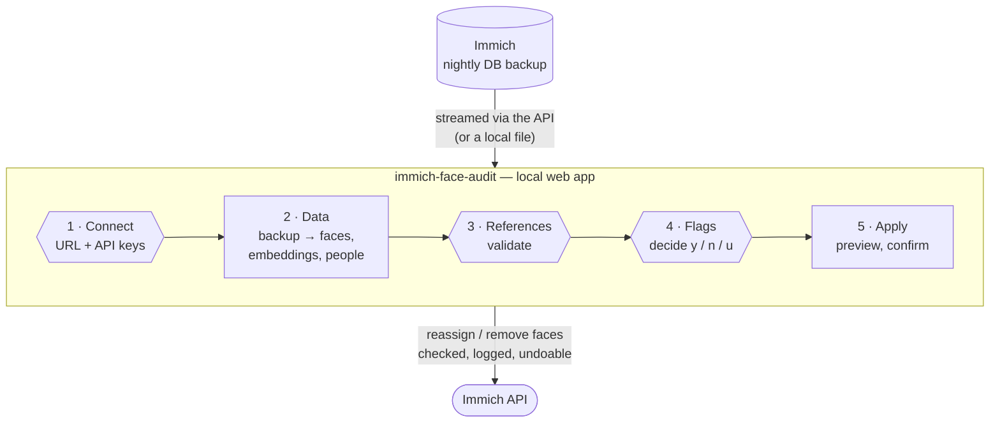

# immich-face-audit

Find and fix misassigned faces across a whole [Immich](https://immich.app/) library, in particular
**look-alike relatives**: siblings and cousins as toddlers, parents and their children at the same age.

It uses the face embeddings Immich has already computed, so **nothing is re-scanned** and no ML job is
queued. It builds a per-person, per-period set of reference faces, lets you validate it, scores every
face in the library against it, and walks you through the discrepancies. Everything happens in a local web
app, from connecting to Immich to applying the fixes. Nothing is written to Immich until you confirm it on the
last step, and everything it writes can be undone.

On a 117k-face library it extracts in about 30 s, builds references in about 5 s and scores every face in about 15 s.



## Why periods matter

Immich assigns a new face to the person whose *nearest* stored face is closest. For look-alike
relatives that goes wrong in a specific way: a toddler is compared with every face of their older
cousin or sibling, including that person's own toddler photos taken years earlier, and whoever has the
most photos wins. The person with the biggest photo count slowly "absorbs" the others.

This tool only compares a face with references **from the same period** (±3 years), and only with
people who were **born by then** (when Immich has a birth date for them). A 2-year-old in a 2020 photo is
compared with the 2-year-old cousin of 2020, not with an older sibling's baby photos from 2014.

## Quick start

```
pipx install git+https://github.com/xens/immich-face-audit
immich-face-audit --workdir ~/face-audit
```

A browser tab opens on `http://127.0.0.1:8091`. Follow the five steps along the top:

1. **Connect**: your Immich URL and API keys. Each key is checked against the permissions it needs.
2. **Data**: download the latest database backup from Immich (or point to a backup file). References are built right after.
3. **References**: glance at each person's reference faces and reject any wrong one.
4. **Flags**: *Compute flags*, then go through the flagged faces with `y` / `n` / `u`.
5. **Apply**: preview what will change, try one, then apply the rest. *Undo all* is on the same page.

The same steps are available from the command line, for scripting:

```
immich-face-audit extract --latest-backup     # or: extract immich-db-backup-XXXX.sql.gz
immich-face-audit baseline
immich-face-audit score
immich-face-audit apply                       # dry run
immich-face-audit apply --write
immich-face-audit undo --write
```

The sections below explain what each step does.

## How each step works

### Data: extract

The face embeddings are not available through Immich's API; they only exist in the database. But
Immich writes a nightly database backup (`UPLOAD_LOCATION/backups/immich-db-backup-*.sql.gz`, see
*Administration → Settings → Backup*), and `extract` reads that. It streams the file and keeps four tables:
assets, faces, face embeddings and people. It never restores Postgres and never reads anything else.
User accounts and credentials in the dump are skipped.

Two ways to get the backup:

- `extract --latest-backup` asks the Immich API for its newest backup and streams it straight into the
  parser, so it's never written to disk. This needs a key from an **admin** account with `maintenance` and
  `backup.download`, which is a powerful key: see [API keys](#api-keys).
- `extract path/to/immich-db-backup-….sql.gz` uses a copy you took from the backups folder yourself.

If `IMMICH_URL` and `IMMICH_API_KEY` are set, names, birth dates and hidden flags are then refreshed from
the live API, so edits you make in Immich after the dump are picked up.

**Add birth dates in Immich for the people who matter.** They switch on the "photographed before
being born" check, and they keep children out of comparisons for years before they existed.

### Data: building the references

For each named person and each 3-year window, the faces that agree most with each other become that
period's **references** (up to 40 per window, skipping near-duplicate burst shots). Faces that break a
hard rule are excluded from the start: dated before the birth date, or the same person tagged twice in
one photo. A second pass removes references that look more like someone else's references from the
same period.

### References and flags

In the app (127.0.0.1 only):

- **References**: every proposed reference, per person and period. People who most resemble someone else
  come first, and inside a period the least consistent faces are at the end of the row. Click to reject a bad
  one. Shift-click opens the photo in Immich.
- **Flags**: after *Compute flags*, every face that needs a look, grouped by kind and by person pair.
  Each card shows the flagged face next to a validated reference of the tagged and the suggested person
  from the same period. Press `y` to reassign it to the suggestion, `n` to keep it, `u` to remove the person,
  `←/→` to move between cards and `j/k` to move between groups.

| Flag | Meaning |
|---|---|
| Wrong person? | Tagged X, but Y's references from that period are clearly closer |
| Before birth date | Photo dated before the tagged person's birth. Either the tag or the photo date is wrong |
| Tagged twice in one photo | The same person on two faces. The less similar face is flagged |
| Looks like nobody | Tagged X, but X scores low and nobody else fits either |
| Unnamed → suggestion | An unassigned face, or a face in an unnamed cluster, that clearly matches someone |

Everything you decide is saved as you go. You can stop and resume at any time.

### Apply

The Apply page shows what will change, with a crop of each face, before anything is written. From the
command line, `apply` is a dry run unless you pass `--write`. For each decision it:

1. reads the face back from Immich and **skips it if it has changed since you reviewed it**,
2. reassigns it (`accept`), or moves it to a new unnamed person (`remove`, which is what Immich's own
   "not this person" does, since the API can't set a face to "no person"),
3. appends the change to `apply_log.jsonl` *before* verifying it, so anything that landed can be undone,
4. reads the face back again to confirm.

Running it again only does what's left. `undo --write` replays the log backwards.

## Running it again later

**Keep the same `--workdir` between audits.** Your decisions live there. On the next run, faces you
already marked *keep* show up as decided, so you only review what is new, and the undo log keeps its
full history. A second audit also finds more: every face you reassigned becomes a reference, so
unnamed faces that used to be ambiguous now clearly match someone.

```
immich-face-audit --workdir ~/face-audit
```

## Install

Requires Python 3.10+ and numpy.

```
pipx install git+https://github.com/xens/immich-face-audit
# or, from a clone:
python3 -m venv .venv && .venv/bin/pip install -e .
```

> **Use numpy from PyPI, not a distro package.** Some distro builds link the reference BLAS, which makes
> the scoring about 100× slower (minutes instead of seconds). A plain `pip install` brings OpenBLAS.

The app's Connect step writes the configuration for you, to `<workdir>/.env` (owner-only). You can also set it
yourself, in environment variables or a `.env` file in the current directory or the work directory:

```
IMMICH_URL=http://192.168.1.10:2283
IMMICH_API_KEY=...
# only for `extract --latest-backup`:
IMMICH_BACKUP_API_KEY=...
```

### API keys

Create them under Immich → Account Settings → API Keys, with only these permissions:

| Key | Used by | Permissions |
|---|---|---|
| `IMMICH_API_KEY` | `extract` (name refresh) | `person.read` |
| | `review` | `asset.view` |
| | `apply` / `undo` | `asset.view`, `face.read`, `face.update`, `person.read`, `person.create` |
| `IMMICH_BACKUP_API_KEY` | `extract --latest-backup` | `maintenance`, `backup.download` (admin account) |

**The backup key can download your entire database**, including every user's email and password hash.
Keep it separate from the everyday key, create it only when you need it, and revoke it afterwards. If
`IMMICH_BACKUP_API_KEY` is not set, `--latest-backup` falls back to `IMMICH_API_KEY`.

## Privacy

The work directory (`face-audit-data/` by default, or `--workdir`) contains **face embeddings, which are
biometric data**, plus names, birth dates and your API keys. It stays on your machine: `.gitignore` excludes
it, as well as `*.sql.gz`, `*.npy`, `*.tsv` and `.env`.

The web app binds to 127.0.0.1 and keeps the API keys server-side: they are never sent back to the browser.
Because it can write to Immich, it only answers requests addressed to `127.0.0.1:<port>` or
`localhost:<port>`, which blocks DNS-rebinding tricks. It also requires a custom header on every POST, which
stops another website open in your browser from triggering an apply. The only Immich call it relays for the
browser is thumbnail requests.

## Tuning

The thresholds are constants at the top of `baseline.py` and `score.py`: window size, references per
window, and the swap / suggestion margins. The defaults were tuned on a single family library (ArcFace
`buffalo_l`, the Immich default). A different recognition model will need different values.

## Limitations

- Tested against **Immich v3.2.0**. The older schema (`personId` instead of `personGroupId`, before v3) is
  handled and covered by tests, but not tried on a real library.
- Multi-user libraries: people are merged across owners. That's fine for one household, and untested
  beyond that.
- Photo dates come from Immich (`localDateTime`). Misdated scans land in the wrong period, and then usually
  show up as "before birth date" flags.

## Credits

Inspired by [immich-face-fix](https://github.com/pabera/immich-face-fix), which fixes one person pair
at a time interactively. This tool finds the pairs for you across the whole library.

## License

MIT
